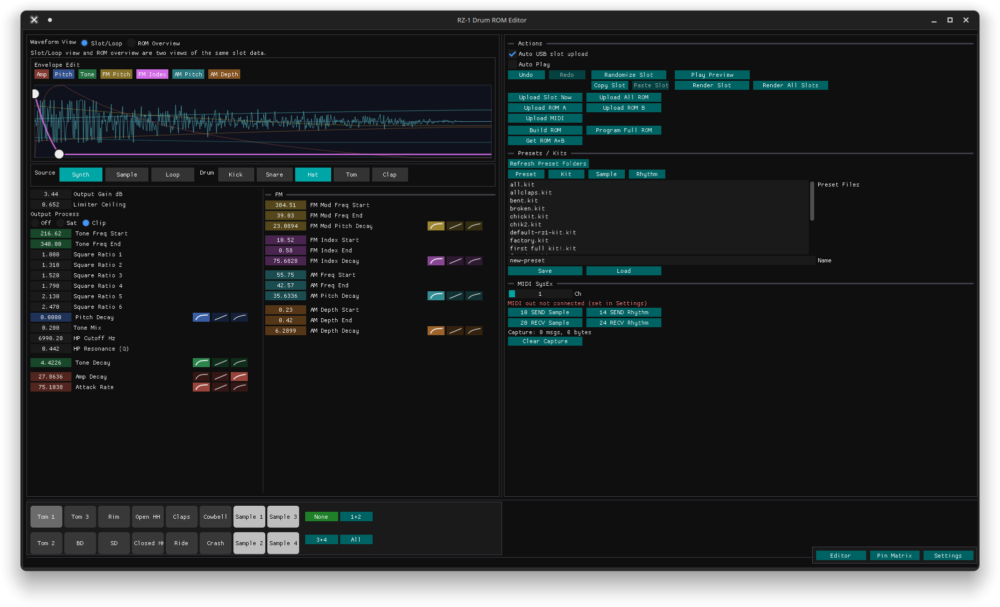
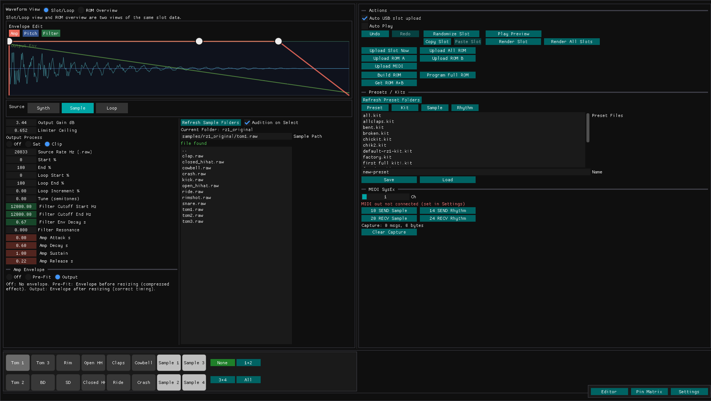
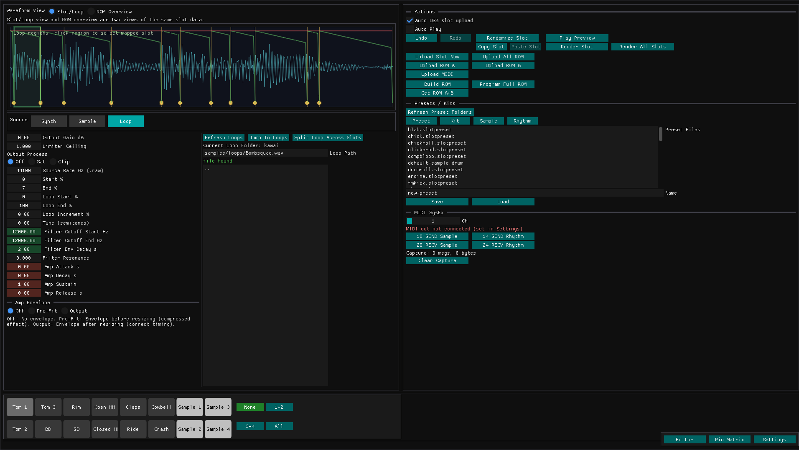

# Drum Rom Designer

Drum Rom Designer is a GUI tool for building and editing drum sounds for hardware drum machines.

It can do a few things - 

1. Synthesize drum sounds.
2. Edit and shape sampled sounds.
3. Export the sounds to Casio Rz-1 sample ROM complatible bin images 
4. Export sample files
5. Load the virtual ROM images in real time to a modified Casio Rz-1 

You can quickly switch between synth drums and sample-based sounds, tune envelopes and tone, manage pad sounds, and build complete kits that are ready for loading to the drum-machine hardware sample ROM.

Currently very early iteration with bad code, many bugs and everything laid out a bit weird. Maybe this will improve, maybe not.. 

This has been made in vscode and currently only compiled by me for ubuntu 25.10

Tested on linux only so far. I have hopes for a windows and mac version.

Planned improvements

- sysex librarian and sample dump is not working yet.

- Profiles for other drum machines - TR-707 and Korg DDD1 being the main focus. Also a Wavetable version for Korg DW6000 and DW8000 of which I have a working prototype. 

- Software bending of the eprom, witout the need for hardware bends. 

## Dependencies

Required to build and run the GUI:

- [Dear ImGui](https://github.com/ocornut/imgui) sources used by the app
- C++17 compiler (g++ or clang++)
- [CMake](https://github.com/Kitware/CMake) 3.16+
- [SDL2](https://github.com/libsdl-org/SDL) development package
- [RtMidi](https://github.com/thestk/rtmidi) development package
- [libsndfile](https://github.com/libsndfile/libsndfile) development package
- [OneROM](https://github.com/piersfinlayson/one-rom) required if you want the OneROM hardware upload/programming to function. You must install the onerom cli to have access to this hardware integration. https://onerom.org/cli/

	

	

	

## Credits

I based the rom generating code and sysex info for this project on the hard work done at https://zine.r-massive.com/casio-rz-1-midi-sysex/ figuring out the sysex format and rom sample address locations. 

Also a big inspiration for the Korg DW6000 & DW8000 mode is here 

https://hackaday.io/project/10113-project-72-korg-dw-6000-wave-memory-expansion

As well as the Strellis mod and all the other eprom hacking tools made by many people on the internet.

You should buy some eprom emulators at https://onerom.org 

For the Elements drum voice mode : This project is a derivative work based on the **Elements** Eurorack module, originally designed by **Émilie Gillet** for **Mutable Instruments**. 

* The original firmware source code can be found at the [Mutable Instruments GitHub](https://github.com).

### License Notes
* **Software:** The firmware code is licensed under the permissive [MIT License](LICENSE).

*Note: This project is an independent production. It is not manufactured, endorsed, or supported by Mutable Instruments.*

## Building 

install dependancies with 

sudo apt install libsdl2-dev libsdl2-image-dev libasound2-dev libsndfile1-dev

install the onerom cli for optional live rom editing

in the main folder run  

cmake -S . -B build --fresh
cmake --build build -j

You can run the program with 

./build/drumrom_gui

YMMV

## What The Program Is For

Drum Rom Designer is designed for musicians and sound designers who want quick drum-machine focused sound creation:

- Design synthesized kicks, snares, hats, toms, and claps.
- Load and sculpt samples for drum pads.
- Save and reload sounds as presets and full kits.
- Organize and audition material both in the application and on the hardware, while you work.
- Prepare playable ROM/sample data for hardware use.
- There is also a sysex dump librarian section for collecting pattern data and sample data from machine that support it. 

## OneROM Integration

Drum Rom Designer includes OneROM integration so you can move quickly from editing sounds to hearing them on hardware.

In the GUI, OneROM support is used for:

- Direct upload to the sample ROM from your current sound design session.
- Programming ROM A and ROM B targets without leaving the app.
- Fast testing kit and sample changes on connected devices.

This required hardware modification of the drum machine - In the case of a Casio RZ-1 this means the removal of the 2 sample rom IC's and replacement with 2 x onerom. 

I have also installed an adafruit usb hub and a panel mounted usb c socket. 

More details on hardware modification later. 

## Use

A typical session looks like this:

1. Pick a slot/pad.
2. Choose a sound type (Synthesised drum or sample, or extract regions from a loop to the individual drum pads).
3. Synthesize or edit a sample to fit the space on the rom and until it sounds right. 
4. Save or load pad presets/ drum kits or sysex dumps.
5. Export samples to .bin files or as rendered audio files.  Or - Upload to the hardware either in real time as you edit or send the entire rom at once.

## Project Folders

- `samples/` raw and source sample files.
- `presets/` saved drum presets and kit files.
- `kits/` full multi-slot kit configurations.
- `roms/` generated ROM/BIN output files, the bins are 27c256 compatible and can burned with an eprom programmer. 
- 'sysex-rhythm/' pattern data from the drum machine - this is a work in progress. 
- 'sysex-samples/' sample data from the Casio Rz-1 sample pads - also work in progress.

## Keyboard Shortcuts

Notes:

- Most shortcuts are ignored while typing in a text field.
- Shortcuts trigger on key press (not key repeat).
- Drum type shortcuts (`1` to `7`) only work when the selected slot is in Synth mode.

### Global Editing Shortcuts

- `Ctrl+Z`: Undo
- `Ctrl+Shift+Z`: Redo
- `Ctrl+Y`: Redo
- `Ctrl+C`: Copy selected slot
- `Ctrl+V`: Paste slot
- `Space`: Play preview for selected slot
- `R`: Randomize selected slot
- `Y`: Randomize reverb
- `T`: Toggle source type (Synth → Sample → Loop → Synth)
- `Ctrl+W` or `Ctrl+Q`: Quit application

### Slot Selection (Pad Keyboard Layout)

Use this key layout to jump directly to one of the 16 slots:

- Top row: `A S D F G H J K` -> slots `1` to `8`
- Bottom row: `Z X C V B N M ,` -> slots `9` to `16`

### Synth Drum Type Selection

When the selected slot is a synth slot:

- `1`: Kick
- `2`: Snare
- `3`: Hat
- `4`: Tom
- `5`: Clap
- `6`: Elements
- `7`: Elements Exact

### File List Navigation

In focused file lists (Preset/Kit/Sample/Rhythm browser):

- `Up Arrow`: Move selection up
- `Down Arrow`: Move selection down
- `Enter` or `Keypad Enter`: Activate current selection
